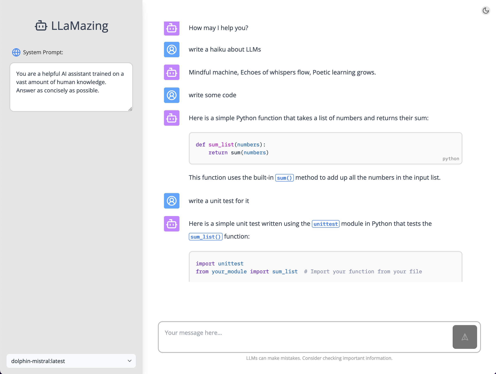
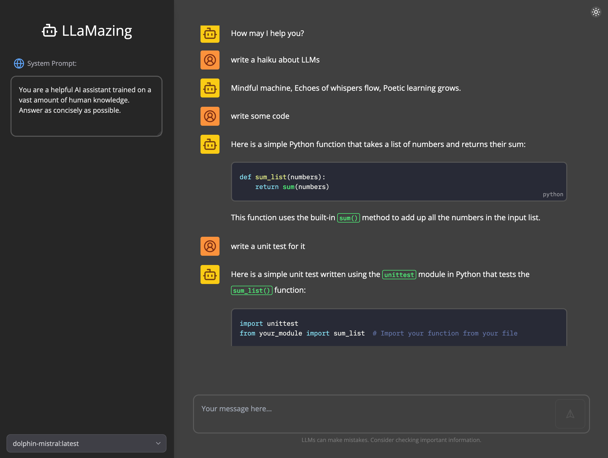

# LLaMazing

A simple frontend to Ollama.

| Light Theme               | Dark Theme               |
| ------------------------- | ------------------------ |
|  |  |

## Install

Install [Ollama](https://ollama.ai/) and run the server.

Download some [models](https://ollama.ai/library). For example, one of my favorites:

```shell
$ ollama pull dolphin-mistral:7b-v2.6-dpo-laser-q6_K
```

Install the web ui

```shell
$ pnpm i
```

## Run

```shell
$ pnpm dev
```
